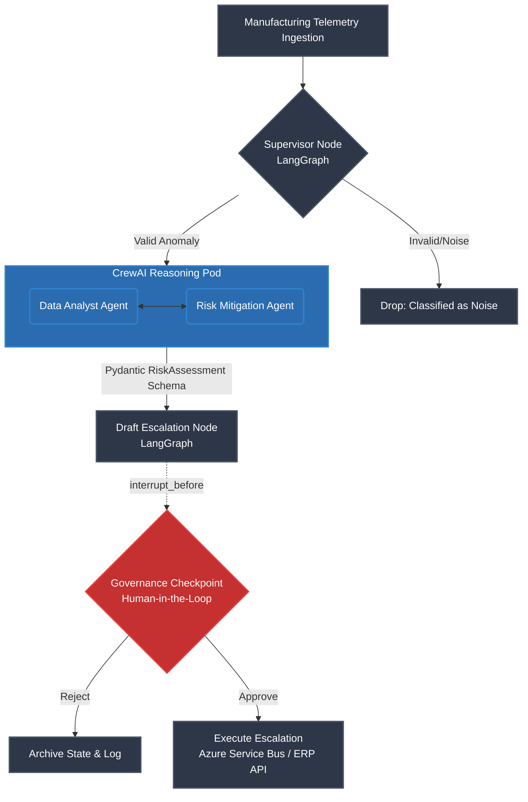

# Enterprise Agentic Orchestrator: Supply Chain Intelligence

Python
LangGraph
CrewAI
Strict Mypy
License

An event-driven, zero-trust multi-agent orchestration engine built for enterprise supply chain operations. 

This system ingests high-velocity manufacturing telemetry, utilizes a hybrid **LangGraph/CrewAI** topology to autonomously investigate anomalies, and enforces strict, deterministic human-in-the-loop governance before triggering downstream procurement escalations.

---

## 📖 Business Context

In Tier-1 aerospace and manufacturing environments, supply chain telemetry generates thousands of alerts daily. Standard LLM chatbots cannot handle this volume, nor can they be trusted to execute procurement actions autonomously without hallucinating.

This repository demonstrates the architectural solution to this problem:

1. **Filtering the Noise:** Deterministic routing drops invalid telemetry before expensive reasoning cycles occur.
2. **Deep Reasoning on Valid Threats:** Multi-agent pods analyze real threats to estimate financial impact and severity.
3. **Zero-Trust Execution:** The AI is allowed to *draft* business actions, but the system forcibly pauses execution to require explicit human ratification.

---

## 🏗️ The Hybrid Architecture

To handle the complexity of enterprise telemetry without creating massive state-management boilerplate, this architecture enforces a strict separation of concerns.

- **The Control Plane (Macro-Orchestration):** LangGraph acts as the deterministic router. It manages the global state payload, enforces Pydantic schemas, and handles the `interrupt_before` execution breakpoints.
- **The Reasoning Pods (Micro-Execution):** CrewAI is utilized strictly for localized, multi-agent brainstorming. It executes deep analysis and returns strictly typed objects back to the overarching graph.

### System Flow Diagram




---

## 🔒 Enterprise Governance Features

1. **Ratified Human-in-the-Loop:** Consequential actions (e.g., halting production, sourcing alternate suppliers) are paused using LangGraph's state checkpointer. Autonomous agents *draft* actions; they cannot *execute* them without human terminal approval.
2. **Immutable Audit Logging:** Every agent decision, state transition, and tool call is checkpointed to a local PostgreSQL database, enabling compliance teams to reconstruct any system action.
3. **Strict Determinism:** Powered by Python 3.14, `uv`, `mypy` (strict mode), and `ruff`. LLM outputs are forced into rigorous `pydantic` v2 schemas at every node transition to prevent data schema hallucination.

---

## 📂 Project Structure

```text
supply-chain-agentic-orchestrator/
├── .github/workflows/ci.yml     # Automated Ruff & Mypy enforcement
├── src/
│   ├── agents/
│   │   ├── crews/
│   │   │   └── risk_investigator.py # CrewAI multi-agent pod
│   │   └── nodes/
│   │       ├── escalation.py        # LangGraph action drafting & execution
│   │       └── supervisor.py        # LangGraph triage routing
│   ├── core/
│   ├── schemas/
│   │   └── telemetry.py         # Pydantic v2 enterprise data models
│   ├── state/
│   │   └── graph_state.py       # LangGraph TypedDict (The Audit Payload)
│   ├── tools/
│   └── main.py                  # Event ingestion & pipeline compilation
├── docker-compose.yml           # PostgreSQL state persistence infrastructure
├── pyproject.toml               # Strict linting & typing rules
└── .env                         # Observability & LLM credentials
```

---

## 🚀 Quickstart

This project uses `uv` for blazing-fast, deterministic dependency resolution.

### 1. Environment Setup

```bash
# Clone the repository
git clone [https://github.com/yourusername/supply-chain-agentic-orchestrator.git](https://github.com/yourusername/supply-chain-agentic-orchestrator.git)
cd supply-chain-agentic-orchestrator

# Configure environment variables
cp .env.example .env
# Ensure you add your OPENAI_API_KEY to the .env file
```

### 2. Run the Infrastructure (Optional)

To test the immutable audit log functionality, spin up the local PostgreSQL instance:

```bash
docker compose up -d
```

### 3. Execute the Pipeline

Run the event ingestion pipeline. Watch as the system triages the event, triggers the CrewAI pod, drafts an action, and physically pauses execution to await your approval.

```bash
uv run python src/main.py
```

---

## 🛠️ Tech Stack & Toolchain

- **Routing & State Management:** LangGraph, `langgraph-checkpoint`
- **Micro-Execution Reasoning:** CrewAI, LangChain OpenAI (GPT-4o)
- **Data Validation:** Pydantic v2
- **Code Quality:** `uv`, `ruff`, `mypy` (strict mode enabled)

